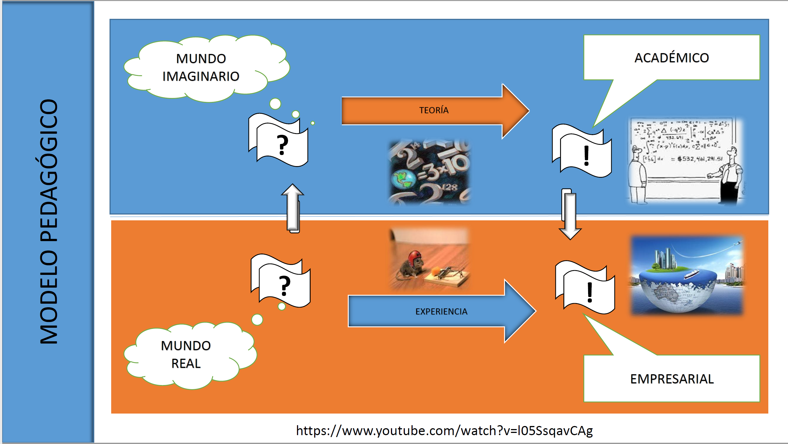
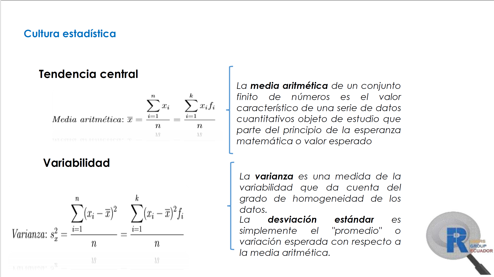

```{r include=FALSE}
colorize <- function(x, color) {
  if (knitr::is_latex_output()) {
    sprintf("\\textcolor{%s}{%s}", color, x)
  } else if (knitr::is_html_output()) {
    sprintf("<span style='color: %s;'>%s</span>", color,
      x)
  } else x
}
```
```{r, include = FALSE}
knitr::opts_chunk$set(
  dev = "png",
  dpi = 150,
  fig.asp = 0.618,
  fig.width = 5,
  out.width = "60%",
  fig.align = "center",
  collapse = TRUE,
  comment = "#>"
)
```
En esta viñeta se encontrará material extra referente al paquete *qcr*, cartas de control, FDA, entre otros.

* A continuación se muestra el material utilizado en la presentación "Control Estadístico de la Calidad y Seis Sigma con R"








* A continuación se pueden observar las diapositivas utilizadas en el V Xornada de Usuarios
de R en Galicia. 

## `r colorize("Nuevas Librerias para el Control Estadísitco de la Calidad (*qcr*) y Estudios Interlaboratorio (*ILS*) en la Industria:","#2E2EFE")`
<br>

<object data="Articles/11_salvador_naya.pdf" width=775, height=550></object>

<br>

* Se presenta el Proyecto presentado para el cumplimiento de los requisitos para culminar el Máster en Técnicas Estadísticas de la Universidad de La Coruña del Dr. Miguel Flores, titulado:

## `r colorize("Desarrollo de una aplicación para gráficos de control de procesos industriales","#2E2EFE")` 

<br>

<object data="Articles/proyecto_417.pdf" width=775, height=550></object>

<br>

### `r colorize("Cite","#2E2EFE")`

<p style="text-align:justify;"> Flores Sánchez, M. A. (2013). Desarrollo de una aplicación para gráficos de control de calidad de procesos industriales (Master's thesis, ESPAÑA/Facultad de Matemáticas-Universidad de La Coruña/2013).</p>

```{r eval=FALSE}
@mastersthesis{flores2013desarrollo,
  title={Desarrollo de una aplicaci{\'o}n para gr{\'a}ficos de control de calidad de procesos industriales},
  author={Flores S{\'a}nchez, Miguel Alfonso},
  year={2013},
  school={ESPA{\~N}A/Facultad de Matem{\'a}ticas-Universidad de La Coru{\~n}a/2013}
}
```

* Se presenta la Tesis de Doctorado del Dr. Miguel Flores titulado:

## `r colorize("Nuevas Aportaciones del Análisis de Datos Funcionales en el Control Estadístico de Procesos","#2E2EFE")` 

<br>

<object data="Articles/FloresSanchez_Miguel_TD_2018.pdf" width=775, height=550></object>

<br>

### `r colorize("Cite","#2E2EFE")`

<p style="text-align:justify;"> Flores Sánchez, M. (2018). Nuevas aportaciones del análisis de datos funcionales en el control estadístico de procesos.</p>

```{r eval=FALSE}
@article{flores2018nuevas,
  title={Nuevas aportaciones del an{\'a}lisis de datos funcionales en el control estad{\'\i}stico de procesos},
  author={Flores S{\'a}nchez, Miguel},
  year={2018}
}
```


