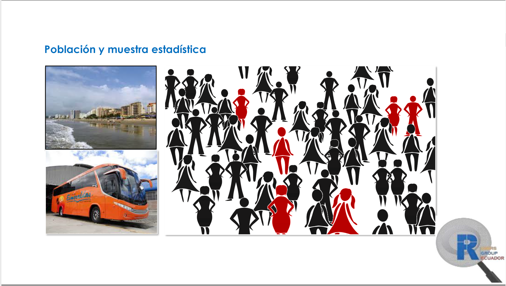
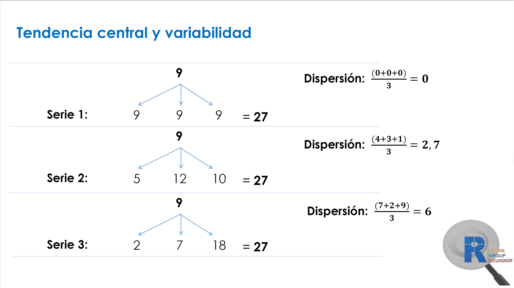

```{r, include = FALSE}
knitr::opts_chunk$set(
  message = FALSE,  warning = FALSE,
  fig.height = 2.5,
  fig.width = 5,
  comment = "#>"
)
```

En esta viñeta se encontrará material extra referente al paquete *qcr*, cartas de control, FDA, etc.

* A continuación se muestra el material utilizado en la presentación "Control Estadístico de la Calidad y Seis Sigma con R"








* En el siguiente enlace se podrá dirigir a las diapositivas utilizadas en el V Xornada de Usuarios
de R en Galicia. Nuevas Librerias para el Control Estadísitco de la Calidad (*qcr*) y Estudios Interlaboratorio (*ILS*) en la Industria:   (https://www.r-users.gal/sites/default/files/11_salvador_naya.pdf)

* En el siguiente enlace se podrá dirigir al Proyecto presentado para el cumplimiento de los requisitos para culminar el Máster en Técnicas Estadísticas de la Universidad de La Coruña del Dr. Miguel Flores, titulado "Desarrollo de una aplicación para gráficos de control de procesos industriales": (http://eio.usc.es/pub/mte/descargas/proyectosfinmaster/proyecto_417.pdf)

* En el siguiente enlace se podrá dirigir a la Tesis de Doctorado del Dr. Miguel Flores titulado "Nuevas Aportaciones del Análisis de Datos Funcionales en el Control Estadístico de Procesos": (https://ruc.udc.es/dspace/handle/2183/22320)